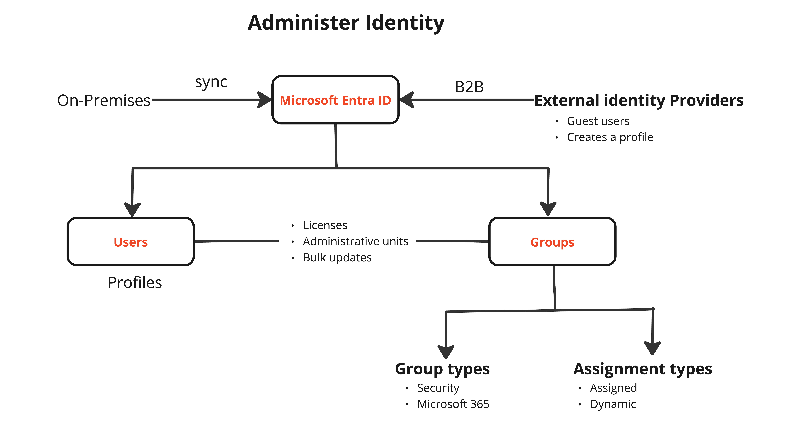

## **Administer Identity**

### Objectives
1. [Configure Microsoft Entra ID](#objective-1-configure-microsoft-entra-id)
    - [Introduction to Microsoft Entra ID](#1-introduction-to-microsoft-entra-id)
    - [Microsoft Entra ID concepts](#2-microsoft-entra-id-concepts)
    - [Microsoft Entra ID Editions](#3-microsoft-entra-id-editions)
    - [Configure Device Identities](#4-configure-device-identities)
2. [Configure User and Group Accounts](./configure-and-manage-user-and-group-accounts.md)
    - [User Accounts](./configure-and-manage-user-and-group-accounts.md#1-user-accounts)
    - [Bulk Operations](./configure-and-manage-user-and-group-accounts.md#2-bulk-operation)
    - [Group Accounts](./configure-and-manage-user-and-group-accounts.md#3-group-accounts)
    - [Self-service password reset (SSPR)](./configure-and-manage-user-and-group-accounts.md#4-self-service-password-reset-sspr)
    - [Multi-tenant environment](./configure-and-manage-user-and-group-accounts.md#5-multi-tenant-environments)

### **Objective 1: Configure Microsoft Entra ID**

---

### **1. Introduction to Microsoft Entra ID**

Microsoft Entra ID (formerly Azure Active Directory) is Microsoft’s cloud-based identity and access management service. It enables organizations to:
- Securely manage access to resources such as Azure services, Microsoft 365 apps, and third-party applications.
- Provide authentication, including multifactor authentication (MFA).
- Offer seamless single sign-on (SSO) to users for secure access.

#### **Key Features**
- Identity protection
- Conditional access
- Self-service password reset (SSPR)
- Role-based access control (RBAC)
- Integration with on-premises Active Directory using Azure AD Connect

#### **Use Cases**
- Centralized identity management for cloud and hybrid environments.
- Application and device management.
- Secure access to resources through Zero Trust principles.

---

#### Identity Overview
An identity refers to any object that can be authenticated. This encompasses:
- **Users**: Individual accounts.
- **Groups**: Collections of users for easier access management.
- **Managed Identities**: System or user-assigned identities for Azure resources.
- **Service Principals**: Application or service-level identities.

---

#### User Identity

A **user identity** represents an individual who accesses resources within an organization or as a guest.

- **Key Characteristics**:
  - Uniquely identified by their **User Principal Name (UPN)**.
  - Can authenticate using passwords, multifactor authentication (MFA), or certificates.

- **Types of Users**:
  - **Members**: Internal users created within the tenant.
  - **Guests**: External users (B2B collaboration) invited to the tenant.

- **Management**:
  - Users can belong to groups, roles, or applications.
  - Permissions and access are assigned based on RBAC or Conditional Access policies.

---

#### Group Identity
A **group identity** is used to simplify access management by assigning permissions to a collection of users.

- **Types of Groups**:
  - **Security Groups**: Manage access to Azure resources.
  - **Microsoft 365 Groups**: Facilitate collaboration in Microsoft 365 apps like Teams or SharePoint.

- **Membership Types**:
  - **Assigned**: Members are added manually.
  - **Dynamic**: Membership is determined by attributes (e.g., department or location).

- **Use Cases**:
  - Assign resource permissions at the group level.
  - Enable efficient management for shared applications or roles.

---

#### Managed Identity
A **managed identity** is a special type of identity for Azure resources that eliminates the need for credentials.

- **Types of Managed Identities**:
  - **System-Assigned**:
    - Tied to an Azure resource's lifecycle (deleted when the resource is deleted).
  - **User-Assigned**:
    - Independent of any specific resource and reusable across multiple resources.

- **Authentication**:
  - Managed identities use OAuth 2.0 tokens issued by Microsoft Entra ID.
  - Tokens are securely retrieved via the resource’s identity endpoint.

- **Use Cases**:
  - Accessing Azure services like Key Vault or Storage without explicit credentials.
  - Secure automation for applications running on Azure VMs, Functions, or Logic Apps.

---

#### Service Principal
A **service principal** is an identity created for applications, automation tools, or services to access Azure resources.

- **Key Characteristics**:
  - Acts as the **identity of an application** or service.
  - Used in **non-interactive scenarios** such as CI/CD pipelines or APIs.

- **Properties**:
  - **Application ID**: Unique identifier of the application.
  - **Object ID**: Identifier of the service principal object.
  - **Tenant ID**: ID of the Microsoft Entra tenant where the principal exists.

- **Authentication**:
  - Uses a client secret or certificate to authenticate.
  - Obtains tokens from Microsoft Entra ID for accessing resources.

- **Use Cases**:
  - Automating deployments and configurations.
  - Enabling third-party applications to integrate with Azure.

---

#### Authentication for Identities
All identities authenticate using the following mechanisms:

- **Credentials**: Passwords, certificates, OAuth tokens, or client secrets.
- **Protocols**:
  - **OAuth 2.0**: For secure API and application authentication.
  - **OpenID Connect**: Extends OAuth 2.0 for user sign-in.
- **Conditional Access**:
  - Policies applied to identities to enforce controls like MFA, device compliance, and session security.

---

#### Governance and Security
Microsoft Entra ID ensures secure and governed access for all identities:

- **Conditional Access**:
  - Apply policies based on user location, device state, or risk level.
- **Identity Protection**:
  - Detect and respond to identity risks, including leaked credentials.
- **Privileged Identity Management (PIM)**:
  - Manage and monitor elevated access roles.
- **Zero Trust Model**:
  - Verify identity, device, and context for every request.

---

#### **Core Components**
1. **Users**: Individual identities within the organization, including employees, partners, and guests.
2. **Groups**: Collections of users for managing access to resources.
3. **Roles**: Permissions assigned to users or groups to perform specific tasks.
4. **Applications**: Integration of enterprise apps for authentication and access.
5. **Devices**: Enrolled devices managed within the organization.

#### **Authentication Methods**
- Password-based authentication
- Multifactor Authentication (MFA)
- Certificate-based authentication
- Windows Hello for Business

#### **Synchronization**
- Azure AD Connect synchronizes on-premises Active Directory with Microsoft Entra ID.
- Password Hash Synchronization (PHS) and Pass-Through Authentication (PTA) options.

---

### **3. Microsoft Entra ID Editions**

Microsoft Entra ID comes in multiple editions, each tailored to different needs.

| **Edition**                | **Features**                                                                                  |
|----------------------------|----------------------------------------------------------------------------------------------|
| **Free**                   | Basic identity management, user/group management, and SSO for Microsoft 365.                |
| **Microsoft Entra ID P1**  | Advanced identity management, Conditional Access, and hybrid identity support.              |
| **Microsoft Entra ID P2**  | Includes all P1 features + Identity Protection, Privileged Identity Management (PIM).       |
| **Microsoft 365 Apps**     | Basic features included with a Microsoft 365 subscription for application management.       |

---

### **4. Configure Device Identities**

Device identities allow organizations to manage and secure the devices accessing their resources.

#### **Device Registration**
- Devices are registered to Microsoft Entra ID to enable identity-based security policies.
- Supports Windows, macOS, iOS, and Android devices.

#### **Steps to Configure Device Identities**
1. **Enable Device Registration**:
   - Go to the Microsoft Entra admin center.
   - Navigate to **Devices > Device Settings**.
   - Configure settings for **Users may join devices to Microsoft Entra ID** and **Require Multifactor Authentication to join devices**.

2. **Manage Device Identity**:
   - Use policies like **Conditional Access** to enforce device compliance.
   - Configure device trust for hybrid environments by integrating with Intune.

3. **Monitor Device Activity**:
   - Use **Microsoft Entra Insights** to monitor device sign-ins and activity.

#### **Device Authentication Modes**
- Azure AD-registered: For personal devices.
- Azure AD-joined: For corporate devices.
- Hybrid Azure AD-joined: For devices joined to an on-premises Active Directory and registered in Microsoft Entra ID.

---

### **Quick Tips for the Exam**
- Understand the differences between **Azure AD editions** (Free, P1, P2).
- Know how **Conditional Access** policies apply to devices and users.
- Familiarize yourself with the configuration options in the **Microsoft Entra admin center**.
